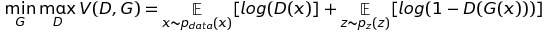
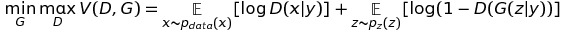
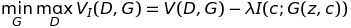
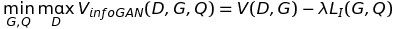
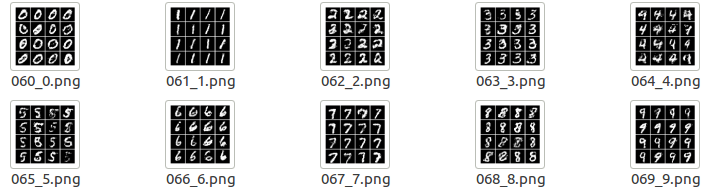
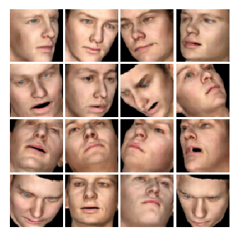

I organized this reposity mainly for learning GANs, so all codes about classical GANs were implemented with simple network structure and tested by MNIST dataset.   
Just know about how mathmatical analysis (in network structure and loss function) works in actual codes, learn how others implement the GANs, and finally, enjoy the magic of GANs :-D   

For more theoretical details and pratical codes about GANs, please go to [GAN_Theories](https://github.com/YadiraF/GAN_Theories) and [GAN_Applications](https://github.com/YadiraF/GAN_Applications), thanks!     

***************

All have been tested with python2.7+ and tensorflow1.0+ in linux.  

* Datas: save training data.  
* Samples: save generated data, each folder contains several figs to **show the results**.  
* utils: contains 2 files  
	- data.py: prepreocessing data.  
	- nets.py: Generator and Discriminator are saved here.  
	
Note:  
> The final layer can be sigmoid(data: [0,1]) or tanh(data:[-1,1]), my codes all use sigmoid.  
> Using weights_initializer=tf.random_normal_initializer(0, 0.02) will converge faster.  

**DCGAN**  

- [x] conv   

**Conditional GAN**  

- [x] condition + mlp `D:G = 1:1`
- [x] condition + conv(dcgan)  `D:G=1:1 faster than mlp`
- [x] dcgan + classifier `D:G:C = 1:1:1 very fast`
- [x] wgan + classifier `D:G:C = 5:1:1  fast`

Note:
> a. The step ratio of G and D is important and it takes some time to reach the balance. Condition+mlp with D:G = 1:1 works better than 2:1.   
> b. Adding a classfier to trained with conditions and constraint G works faster and better than appending conditions to images for D training.  

**Wasserstein GAN**

- [x] wgan + mlp `D:G = 5: 1 not good, need to *modify*`
- [x] wgan + conv(dcgan) `D:G = 5:1 clip = 0.01`

**infoGAN**

- [x] infogan + mlp + D and Q not share `Q loss to update G(as feedback) not  good `
- [x] infogan + mlp + D and Q share `not  good. lacking numbers`
- [x] infogan + conv + D and Q not share `clear and have 10 number`
- [x] infogan + conv + D and Q share `the same with not share, not faster? `
- [ ] infogan + wgan + D and Q not share `to be done`  

Results are shown in the end of this page.   

# Adversarial Nets  

:sparkles: GAN  
--------
**The beginning.**  
The first paper.   

Two main research directions:  
1. stabilize the training  
2. apply GAN  
### paper  
[[Generative Adversarial Nets]](https://arxiv.org/pdf/1406.2661.pdf)   

- **Loss** :  
  

### blog
[[openai/generative-models]](https://blog.openai.com/generative-models/#contributions) (Motivation, Game Theory)   
[[wiseodd/gan-tensorflow]](http://wiseodd.github.io/techblog/2016/09/17/gan-tensorflow/) (Introduction, Implementation)  

 ***************
 
:sparkles:DCGAN  
--------
**stabilize the training with some architectural constraints.**  
GAN is hard to train.   
Stabilize Generative Adversarial networks with some architectural constraints.  
Popular used in cv. Most used architecture.  

### paper  
[[Unsupervised Representation Learning with Deep Convolutional Generative Adversarial Networks]](https://arxiv.org/pdf/1511.06434.pdf)  

**Architecture guidelines for stable Deep Convolutional GANs**  

* Replace any pooling layers with strided convolutions (discriminator) and fractional-strided convolutions (generator).  
* Use batchnorm in both the generator and the discriminator  
* Remove fully connected hidden layers for deeper architectures. Just use average pooling at the end.  
* Use ReLU activation in generator for all layers except for the output, which uses Tanh.
* Use LeakyReLU activation in the discriminator for all layers.  

### blog
[[bamos/deep-completion]](http://bamos.github.io/2016/08/09/deep-completion/)  (Introduction, Implementation)  

### code
[[carpedm20/DCGAN-tensorflow]](https://github.com/carpedm20/DCGAN-tensorflow)( star 1.6k+,  many files, easy to run, hard to read and modify)  
> G: fc-->reshape--> deconv bn relu (4) --> tanh  
> D: conv bn lrelu[leak=0.2] (4) --> reshape--> fc(opn=1)-->sigmoid  
> G Loss:   
>
		tf.reduce_mean(sigmoid_cross_entropy_with_logits(self.D_logits_,tf.ones_like(self.D_)))
> D Loss:   
>
		tf.reduce_mean(sigmoid_cross_entropy_with_logits(self.D_logits, tf.ones_like(self.D))) + tf.reduce_mean(sigmoid_cross_entropy_with_logits(self.D_logits_, tf.zeros_like(self.D_)))
> Solver: Adam lr=0.0002  stepG:stepD=1:1   
> Data: mnist celebA __normalized to [-1,1] for tanh  and  [0,1] for sigmoid__  

[[sugyan/tf-dcgan]](https://github.com/sugyan/tf-dcgan)( star 20,  easy to read, just 1 dcgan file. dcgan, generator, discriminator all class. not tf.contrib.layers. )  
> G: fc-->reshape--> deconv bn relu (4) --> tanh  
> D: conv bn lrelu[leak=0.2] (4) --> reshape--> fc(opn=2 one-hot?)  
> Losses:  softmax_cross_entropy_with_logits  
> Solver: Adam lr=0.0002  stepG:stepD=1:1   

 ***************
 
:sparkles:Conditional GAN  
--------
**Apply GAN by adding condition(supervised)**  
Add conditions to GAN by feeding y to G.   
G(z)-->G(z,y)  D(X)-->D(X,y)  
- z: the same as in GAN. unconstrained noise to generate a image.  
- y: the condition to constraint the network. supervised.  
A very important structure that used in image applications (data augmentation, image transfer, etc.)   
Make GAN useful.   

### paper
[[Conditional Generative Adversarial Nets]](https://arxiv.org/pdf/1411.1784.pdf)  

- **Loss** :  
   

### blog
[[wiseodd/conditional-gan-tensorflow]](http://wiseodd.github.io/techblog/2016/12/24/conditional-gan-tensorflow/)  (Fomulation, Architecture, Implementation)  

### code
[[wiseodd/conditional_gan]](https://github.com/wiseodd/generative-models/blob/master/GAN/conditional_gan/cgan_tensorflow.py)(star 500+, very simple, 1 file, easy to read and run,  not conv, inconvinient to extend)  
> G: concat(z,y)-->fc-->sigmoid  
> D: concat(z,y)-->fc-->sigmoid loss  
> Solver: Adam lr=0.001  stepG:stepD=1:1   
> Data: mnist __[0,1]__  

[[zhangqianhui/Conditional-Gans]](https://github.com/zhangqianhui/Conditional-Gans)(star 16, easy to extend)  
> G: concat(z,y)-->fc-->conv-->sigmoid  
> D: **conv_concat(x,y)**-->conv-->fc-->sigmoid loss  
> Solver: Adam lr=0.0002  stepG:stepD=2:1   
> Data: mnist __[0,1]__  

[[fairytale0011/Conditional-WassersteinGAN]](https://github.com/fairytale0011/Conditional-WassersteinGAN/blob/master/WGAN_AC.py) (star 6. use wgan to train GAN, use separate classifier to enforce the condition. very clear, easy to read and modify)  
> G: concat(z,y)-->fc-->conv-->tanh  
> D: X-->conv-->fc-->sigmoid loss  
> **classifier**: X-->conv-->fc-->softmax loss (real label to train classifier, fake label to train G)   
> clip D var  
> Solver: RMS  lr=0.0002  stepG:stepD:stepC_real:stepC_fake=1:10:0.5:0.5   
> Data: mnist __[-1,1]__  

 ***************

:sparkles:Wasserstein GAN
--------
**stabilize the training by using Wasserstein-1 distance**  
GAN before using JS divergence has the problem of non-overlapping, leading to mode collapse and convergence difficulty.   
Use EM distance or Wasserstein-1 distance, so GAN solve the two problems above without particular architecture (like dcgan).   

### paper
[[Wasserstein GAN]](https://arxiv.org/pdf/1701.07875.pdf)

**Algorithm guidelines for stable GANs**  

* No log in the loss. The output of D is no longer a probability, hence we do not apply sigmoid at the output of D
* Clip the weight of D (0.01)
* Train D more than G (5:1)
* Use RMSProp instead of ADAM
* Lower learning rate (0.00005)

### blog
[[AidenN/WassersteinGAN]](https://paper.dropbox.com/doc/Wasserstein-GAN-GvU0p2V9ThzdwY3BbhoP7)  (Theory)  
[[wiseodd/wasserstein-gan]](http://wiseodd.github.io/techblog/2017/02/04/wasserstein-gan/)  (Introduction, Implementation)  
[[zhihu/Wassertein GAN]](https://zhuanlan.zhihu.com/p/25071913)   (Introduction, Analysis)  

### code
[[wiseodd/wgan_tensorflow]](https://github.com/wiseodd/generative-models/blob/master/GAN/wasserstein_gan/wgan_tensorflow.py)(very simple, use mlp)  
> G: fc-->sigmoid  
> D: fc  clip D  
> G Loss:   
>
		G_loss = -tf.reduce_mean(D_fake)
> D Loss:   
>
		D_loss = tf.reduce_mean(D_fake) - tf.reduce_mean(D_real) 
> Solver: RMSProp lr=0.0001  stepG:stepD=1:5   

****************

:sparkles:InfoGAN
--------
**Apply GAN by learning conditions(unsupervised)**  
Attempt to make conditional learned automatically. Find and control some useful information in the images.  
- z: the same as in GAN. unconstrainted noise to generate a image.  
- c: like c in conditional GAN, but learned by Q instead of given what that is, unsupervised.  

### paper
[[InfoGAN: Interpretable Representation Learning by Information Maximizing Generative Adversarial Nets]](https://arxiv.org/pdf/1606.03657.pdf)

- **Loss** :

   

Define: Q(c|x) to approximate P(c|x)(which is the conditional distribution)  

   

### blog
[[wiseodd/infogan]](http://wiseodd.github.io/techblog/2017/01/29/infogan/)  (Introduction Implementation)  

### code
[[openai/infogan]](https://github.com/openai/InfoGAN)( star 300+,  hard to read and modify, too much files)  
> G: fc(1024 bn relu)-->fc (bn relu) reshape--> deconv bn relu --> deconv flatten--> activate  
> D and Q:   
> shared: reshape-->conv lrelu --> conv bn lrelu --> fc bn lrelu   
> D: fc(1) --> activate  
> Q: fc(128) bn lrelu --> fc (c_dim) --> activate    
> activate: softmax(Categorical)  / mean stddev:sqrt(e^x) (Gaussian) / sigmoid(Bernoulli)  
> Losses:   
> D and G: sigmoid as DCGAN   
> Q: cross entropy loss (softmax for discrete) ** add Q loss to D and G loss **  
> Solver:   
> Adam beta1=0.5 stepG:stepD=1:1   

*my understanding*:   
> Adding Q loss to D and G loss, then updating D var and G var by 1:1 **equal to** Q loss to update Q(D) var and G var by Q:D:G=2:1:1  

[[wiseodd/infogan-tensorflow]](https://github.com/wiseodd/generative-models/blob/master/GAN/infogan/infogan_tensorflow.py)(also simple, use mlp)  
> Q: fc --> softmax with c (not share with D)  update vars: G and Q  
> Solver: Adam G:D:Q = 1:1:1  

# Results
All images shown here are from `./Samples`, for more information about results, please go to the folder.   
Then first number of image name is the trianing epoches.   
For better observing, I keep generated images in the beginning, middle and final training process for each algorithm.  

**Conditional GAN**  

- [x] condition + mlp `each pic has the same condition`  

   
 
 
- [x] condition + conv(dcgan)   `each row has the same condition: [0 0 0 0; 1 1 1 1; 2 2 2 2; 3 3 3 3]`    

   

- [x] dcgan + classifier `condition: [0 1 2 3; 4 5 6 7; 0 1 2 3; 4 5 6 7]  `

   

- [x] wgan + classifier  `condition: [0 1 2 3; 4 5 6 7; 0 1 2 3; 4 5 6 7]  `

   

**InfoGAN**  
The generated images with the same condition belong to the same category.  

- [x] infogan + conv + D and Q not share `condition: [0 1 2 3; 4 5 6 7; 8 9 0 1; 2 3 4 5] `  

   

- [x] infogan + conv + D and Q share `condition: [0 1 2 3; 4 5 6 7; 8 9 0 1; 2 3 4 5] `  

   

**DCGAN**

* 3D face result (dcgan)  
   

# Others
Tensorflow style: https://www.tensorflow.org/community/style_guide  
tf.concat(1,[x,y]) in tf 0.12- --->  tf.concat([x,y],1) in tf 1.0+.  
use tf.get_Variable or tf.contrib.layers to reuse variables.  

A good website to convert latex equation to img(then insert into README):
http://www.sciweavers.org/free-online-latex-equation-editor 

